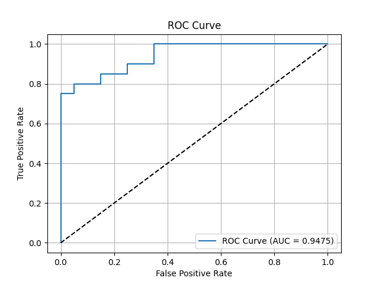

### Defect Detection with Autoencoder
This project implements a defect detection system using a convolutional autoencoder trained on the MVTec AD dataset (bottle category). The system detects defects in images by reconstructing input images and measuring reconstruction errors. It includes a training pipeline, ONNX model export, and a FastAPI-based inference API with data drift detection.

### Table of Contents

Project Overview
Features
Directory Structure
Requirements
Setup Instructions
Training the Model
Exporting to ONNX
Running the FastAPI Server
Generating Image Proofs
API Endpoints
Evaluation Metrics
Contributing
License

### 3Project Overview
This project uses a convolutional autoencoder to detect defects in bottle images from the MVTec AD dataset. The autoencoder is trained on "good" images to learn a normal representation, and defects are identified by high reconstruction errors. The trained model is exported to ONNX format for deployment, and a FastAPI server provides an endpoint for real-time defect detection. Data drift detection is implemented using Evidently AI to monitor model performance.
Features

### Autoencoder Model: A convolutional autoencoder with encoder-decoder architecture for anomaly detection.
### Custom Dataset: Supports the MVTec AD dataset (bottle category) for training and testing.
### Loss Function: Combines Mean Squared Error (MSE) and Structural Similarity Index (SSIM) for robust training.
### Evaluation: Computes AUROC scores and optimal thresholds for defect detection.
### ONNX Export: Exports the trained model to ONNX format for cross-platform compatibility.
### FastAPI Server: Provides a REST API for defect detection with image uploads and data drift monitoring.
### 3Visualization: Generates loss curves, AUROC plots, ROC curves, and sample reconstructions for model performance analysis.

### Directory Structure
├── bottle/                    ###  MVTec AD dataset (bottle category)
├── autoencoder_best.pth       ###  Saved best model weights
├── threshold.npy              ###  Optimal threshold for defect detection
├── autoencoder.onnx           ###  Exported ONNX model
├── train.py                   ###  Training script for the autoencoder
├── model.py                   ###  Autoencoder model definition
├── export_onnx.py             ###  Script to export model to ONNX
├── app.py                     ###  FastAPI server for inference
├── proofs/                    ###  Directory for generated image proofs
├── README.md                  ###  Project documentation
└── requirements.txt           ###  Python dependencies

### Requirements

Python 3.8+
PyTorch
torchvision
OpenCV (opencv-python)
FastAPI (fastapi, uvicorn)
ONNX Runtime (onnxruntime)
Evidently AI (evidently)
pytorch-msssim
matplotlib
scikit-learn
numpy
pandas

Install dependencies using:
pip install -r requirements.txt

Sample requirements.txt:
torch
torchvision
opencv-python
fastapi
uvicorn
onnxruntime
evidently
pytorch-msssim
matplotlib
scikit-learn
numpy
pandas

Setup Instructions

Clone the Repository:
git clone <repository-url>
cd <repository-directory>

### Install Dependencies:
pip install -r requirements.txt

Download MVTec AD Dataset:

Download the bottle dataset from the MVTec AD dataset.
Place it in the bottle/bottle directory with train/good and test/good, test/broken_large subdirectories.

### Directory Setup:Ensure the dataset is structured as:
bottle/bottle/
├── train/
│   └── good/
├── test/
│   ├── good/
│   └── broken_large/

### Training the Model
Run the training script to train the autoencoder and save the best model based on AUROC:
python train.py

### Output: 
autoencoder_best.pth: Best model weights.
threshold.npy: Optimal threshold for defect detection.
Image proofs in proofs/ directory: loss_curves.png, auroc_curve.png, roc_curve.png, and reconstruction_*.png.

### Exporting to ONNX
Export the trained model to ONNX format for deployment:
python export_onnx.py

### Output:
autoencoder.onnx: ONNX model file.
Verifies or creates threshold.npy if missing.

### Running the FastAPI Server
Start the FastAPI server for inference:
uvicorn app:app --host 0.0.0.0 --port 8000

Access the API at http://localhost:8000.
Use the /docs endpoint for interactive API documentation.

Generating Image Proofs
To showcase the model's performance, the train.py script generates the following visualizations in the proofs/ directory:

Loss Curves (loss_curves.png): Training and validation loss over epochs.
AUROC Curve (auroc_curve.png): AUROC scores per epoch.
ROC Curve (roc_curve.png): Receiver Operating Characteristic curve with AUC.
Sample Reconstructions (reconstruction_0.png, etc.): Original vs. reconstructed images for the first three test images.

To generate additional proofs:

### API Response Screenshots:

Use the FastAPI interactive docs (http://localhost:8000/docs) to test the /detect endpoint.
Upload sample images (good and defective bottles) and capture screenshots of the JSON responses.
Alternatively, use curl or Postman:curl -X POST "http://localhost:8000/detect" -F "file=@path/to/image.jpg" > response.json

Convert JSON responses to images using a tool like json-to-image or take screenshots manually.

Organize Proofs:
mkdir proofs

### Reference images in this README:
###  Visual Proofs
- **Loss Curves**: 
- **AUROC Curve**: 
- **ROC Curve**: 
- **Sample Reconstructions**: 

API Endpoints

GET /: Returns a welcome message and API status.
Example: {"message": "Defect Detection API", "status": "running"}

POST /detect: Upload an image to detect defects.
Input: Image file (JPEG/PNG).
Output: JSON with defect status, reconstruction error, threshold, drift status, and filename.
Example:{
  "defect": true,
  "error": 0.015,
  "threshold": 0.01,
  "drift": false,
  "filename": "bottle.jpg"
}

GET /health: Checks API health and model status.
Example:{
  "status": "healthy",
  "model_loaded": true,
  "threshold": 0.01,
  "reference_data_size": 1000
}

Evaluation Metrics

AUROC: Measures the model's ability to distinguish between good and defective images.
Reconstruction Error: Mean squared error between input and reconstructed images.
Threshold: Optimal threshold for defect classification based on Youden's J statistic.
Data Drift: Monitors shifts in reconstruction error distribution using Evidently AI.

Contributing
Contributions are welcome! Please:

License
This project is licensed under the MIT License. See the LICENSE file for details.
